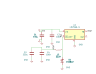

# MCP-KiCad

**Diseña esquemas electrónicos hablando con Claude.** Es un servidor [MCP](https://modelcontextprotocol.io) que permite a un modelo de lenguaje dibujar esquemas de KiCad de verdad — colocando componentes, cableando nets, añadiendo símbolos de alimentación y pasando el chequeo eléctrico del propio KiCad — y devolverte un fichero `.kicad_sch` que puedes abrir, editar y llevar a fabricación.

*[Read me in English](README.md)*

<p align="center">
  
</p>

<p align="center"><em>Un convertidor reductor con LM2596. Nadie lo dibujó a mano: se compiló a partir de una descripción de texto, y pasa el ERC.</em></p>

---

## Qué hace exactamente

Le pides un circuito en lenguaje normal. Claude escribe una descripción declarativa corta y llama a una sola herramienta, `compile_schematic`, que convierte esa descripción en un esquema terminado.

> **Tú:** Hazme un astable con un 555 a 1 Hz aproximadamente, alimentado a 5 V.
>
> **Claude:** *[consulta los nombres reales de los pines del NE555, escribe el diseño y lo compila]*
> Listo — 7 componentes, ERC limpio. Aquí tienes la vista previa.

El resultado se abre en KiCad como cualquier otro esquema. No es un dibujo: es un fichero real con una netlist real, listo para pasar a PCB.

### Por qué el resultado sirve

Generar *algo* es fácil; generar un esquema que un humano acepte, no. Cada esquema compilado se comprueba antes de que lo veas, y el compilador se niega a emitir nada que falle:

| Garantía | Cómo se impone |
|---|---|
| Ningún cable cruza otro de una net distinta | Una barrera geométrica revisa cada segmento. Los infractores pasan a ser etiquetas de net |
| Ningún cable atraviesa el cuerpo de un componente | La misma barrera, contra el contorno real de cada símbolo |
| Todas las conexiones declaradas existen | El fichero terminado se vuelve a leer y su netlist se compara con lo que pediste |
| No hay conexiones de más | La misma comprobación al revés: un cable que toca un pin que no debe es un error |
| Los símbolos de alimentación tocan sus pines de verdad | Se verifica por contacto físico, no por nombre de net |
| KiCad está de acuerdo | `kicad-cli` ejecuta el ERC sobre el resultado y el informe viene incluido |

Si una conexión no se puede dibujar limpia, degrada a etiqueta de net en vez de producir un cable que miente. **El esquema nunca está mal en silencio.**

### Qué no hace

- **Nada de PCB.** Ni layout, ni ruteo de cobre, ni Gerbers. Solo esquemas, a propósito: una PCB hecha a partir de un mal esquema no vale nada.
- **No se inventa componentes.** Usa las librerías de símbolos instaladas de KiCad. Lo que no esté se puede descargar de SnapEDA si aportas una clave de API.
- **No es un simulador.** Dibuja lo que le describes; no te dice si tu circuito es buena idea.

---

## Requisitos

| | |
|---|---|
| **KiCad 10** | Aporta `kicad-cli`, que se usa para el ERC y para renderizar. Versiones anteriores no están probadas. |
| **Claude Desktop** o **Claude Code** | O cualquier otro cliente MCP. |
| **Go 1.24+** | Solo si compilas desde el código fuente. |

---

## Instalación

### Opción A — un clic (recomendado)

Descarga **`mcp-kicad.mcpb`** desde [**Releases**](https://github.com/unmateria/MCP-Kicad/releases/latest) y haz doble clic. Claude Desktop lo instala como extensión: sin editar JSON y sin escribir rutas. El bundle lleva dentro las versiones de Windows, macOS y Linux, así que el mismo fichero vale para todo.

Después salta directamente a [Comprobar que funciona](#comprobar-que-funciona).

> En Apple Silicon la versión de macOS del bundle corre bajo Rosetta. Si prefieres la nativa, coge `mcp-kicad-darwin-arm64` de la Opción B.

### Opción B — descargar un binario

1. Entra en [**Releases**](https://github.com/unmateria/MCP-Kicad/releases) y descarga el fichero de tu sistema:

   | Sistema | Fichero |
   |---|---|
   | Windows (Intel/AMD) | `mcp-kicad-windows-amd64.exe` |
   | Linux (Intel/AMD) | `mcp-kicad-linux-amd64` |
   | Linux (ARM, p. ej. Raspberry Pi) | `mcp-kicad-linux-arm64` |
   | macOS (Apple Silicon) | `mcp-kicad-darwin-arm64` |
   | macOS (Intel) | `mcp-kicad-darwin-amd64` |

2. Ponlo donde quieras — por ejemplo `C:\Tools\mcp-kicad.exe` o `~/bin/mcp-kicad`.

3. En Linux y macOS, dale permiso de ejecución:

   ```bash
   chmod +x ~/bin/mcp-kicad
   ```

   En macOS el primer arranque queda bloqueado porque el binario no está firmado. Se desbloquea con:

   ```bash
   xattr -d com.apple.quarantine ~/bin/mcp-kicad
   ```

No hay que instalar nada más. El binario es autocontenido y no necesita fichero de configuración: encuentra KiCad por su cuenta.

### Opción C — compilar desde el código

```bash
git clone https://github.com/unmateria/MCP-Kicad.git
cd MCP-Kicad
go build -o mcp-kicad ./cmd/server      # añade .exe en Windows
```

---

## Conectarlo con Claude

*No hace falta si instalaste el bundle `.mcpb`: se registra solo.*

### Claude Desktop

Edita el fichero de configuración — créalo si no existe:

| Sistema | Ubicación |
|---|---|
| Windows | `%APPDATA%\Claude\claude_desktop_config.json` |
| macOS | `~/Library/Application Support/Claude/claude_desktop_config.json` |
| Linux | `~/.config/Claude/claude_desktop_config.json` |

Añade el servidor:

```json
{
  "mcpServers": {
    "kicad": {
      "command": "C:\\Tools\\mcp-kicad.exe",
      "args": []
    }
  }
}
```

En Linux o macOS el comando es una ruta normal: `"/home/tuusuario/bin/mcp-kicad"`.

> **Aviso para Windows:** en JSON las barras invertidas van dobladas (`C:\\Tools\\...`). Una sola barra es, con diferencia, el motivo más habitual de que el servidor no arranque.

**Después cierra Claude Desktop del todo y vuelve a abrirlo.** Recargar la ventana no basta: el servidor corre como proceso hijo y solo arranca en un reinicio completo.

### Claude Code

```bash
claude mcp add kicad -- /ruta/a/mcp-kicad
```

### Comprobar que funciona

Pídele a Claude:

> Usa get_project_info para comprobar la configuración de KiCad.

Debería devolverte la ruta de `kicad-cli` detectada, los directorios de librerías y el directorio de salida. Si dice que no encuentra `kicad-cli`, mira [Configuración](#configuración) más abajo.

---

## Cómo usarlo

Describe el circuito y ya está. Concreta lo que te importe — tensión de alimentación, referencias que quieras usar, valores que ya tengas decididos — y deja el resto en manos de Claude.

Peticiones que funcionan bien:

> Diséñame una fuente regulada de 5 V a partir de 12 V de entrada con un LM7805, con desacoplo a la entrada y a la salida y un LED de encendido.

> Hazme una placa mínima con un ATmega328P: cristal de 16 MHz con sus condensadores de carga, resistencia de pull-up en el reset, conector ICSP y desacoplo en los dos pines de alimentación.

> Monta un multivibrador astable de dos transistores que haga parpadear dos LEDs a unos 2 Hz.

Cosas útiles que pedir después:

- *"Enséñame el esquema"* — genera una imagen de vista previa.
- *"Expórtalo a PDF"* — a través de `kicad-cli`.
- *"Pasa el ERC"* — el chequeo eléctrico de KiCad, con las violaciones explicadas.
- *"Acerca los condensadores de desacoplo a U1 y recompila"* — la fuente del diseño es texto, así que revisar sale barato.

Los ficheros generados van al directorio de salida (`get_output_dir` te dice cuál es; `set_output_dir` lo cambia).

### La fuente del diseño

Por debajo, Claude escribe un documento JSON pequeño y lo compila. Rara vez tendrás que tocarlo, pero merece la pena verlo, porque explica por qué los resultados son estables: **las posiciones nunca se dan en milímetros, se anclan de pin a pin**.

```json
{
  "version": 1,
  "project": "led_18650",
  "sheet": "auto",

  "blocks": [
    {
      "name": "led",
      "symbols": [
        { "ref": "BT1", "lib": "Device:Battery_Cell", "value": "18650" },
        { "ref": "R1", "lib": "Device:R", "value": "100", "rot": 90,
          "place": { "pin": "1", "at": "BT1.+", "dir": "up", "cells": 1 } },
        { "ref": "D1", "lib": "Device:LED", "value": "LED_RED", "rot": 90,
          "place": { "pin": "A", "at": "R1.2", "dir": "right", "cells": 3 } }
      ]
    }
  ],

  "nets": {
    "VBAT":   ["BT1.+", "R1.1"],
    "_ANODE": ["R1.2", "D1.A"],
    "GND":    ["D1.K", "BT1.-"]
  },

  "power_nets": { "GND": "power:GND" }
}
```

<p align="center">
  
</p>

El primer símbolo de cada bloque lo ancla; los demás cuelgan de un pin de otro ya colocado, a un número entero de celdas de 2,54 mm. Así el esquema se mantiene en rejilla y legible por mucho que el modelo reordene las cosas.

El formato completo está especificado en [`internal/tools/design_format.md`](internal/tools/design_format.md) (el mismo texto que la herramienta `design_guide` le sirve al modelo), y hay trece ejemplos resueltos en [`docs/compiler/`](docs/compiler/) — desde un circuito de dos componentes hasta un controlador de invernadero con 27.

---

## Configuración

No hace falta ninguna. El servidor busca KiCad en los sitios habituales:

- **Windows** — `C:\Program Files\KiCad\<versión>\bin\kicad-cli.exe`, y después el `PATH`
- **Linux** — `/usr/bin/kicad-cli`, `/usr/local/bin/kicad-cli`, y después el `PATH`
- **macOS** — `/Applications/KiCad/KiCad.app/Contents/MacOS/kicad-cli`, y después el `PATH`

Si tienes la instalación en un sitio raro, o quieres cambiar dónde se escriben los ficheros, copia `config.ini.example` a `config.ini` **junto al ejecutable** y rellena lo que necesites:

```ini
[paths]
kicad_cli  = /opt/kicad/bin/kicad-cli
output_dir = /home/tuusuario/esquemas

[api_keys]
snapeda =
```

Por defecto, los ficheros generados van a `<tu carpeta personal>/mcp-kicad/output`.

---

## Herramientas

Expone treinta y dos herramientas. En la práctica Claude lo hace casi todo a través de `compile_schematic`; el resto están para inspeccionar y para reparar un fichero ya existente.

**Diseñar**
`compile_schematic` · `design_guide` · `get_design_context` · `kicad_workflow_help` · `apply_template` · `list_templates`

**Buscar componentes**
`check_component_existence` · `symbol_pins` · `list_symbol_libraries` · `fetch_external_part` · `register_library`

**Leer un esquema**
`read_schematic` · `get_connectivity_summary` · `cluster_components` · `layout_metrics`

**Editar a mano**
`create_schematic` · `add_symbol` · `connect_pins` · `disconnect_pin` · `add_wire` · `add_label` · `add_power_rail` · `junction` · `no_connect` · `connect_netlist` · `batch_schematic`

**Comprobar y exportar**
`validate_design` (ERC/DRC) · `export_schematic_image` (SVG/PDF) · `modify_pcb_layout`

**Puesta a punto**
`get_project_info` · `get_output_dir` · `set_output_dir`

---

## Cómo funciona por dentro

`.design.json` → **compilar** → `.kicad_sch`

1. **Colocar.** La posición de cada símbolo sale de un anclaje a un pin, resuelto a coordenadas absolutas sobre la rejilla de 2,54 mm.
2. **Cablear.** Las conexiones cortas y evidentemente correctas se trazan con geometría cerrada; las largas pasan por un router A\* que esquiva los cuerpos de los componentes.
3. **Alimentación.** Un símbolo de alimentación por pin, desplazado en la dirección a la que apunta el pin, y luego alineados formando raíles.
4. **Barrera.** Se revisa cada cable. Todo lo que cruce otra net, corte un símbolo o se solape en colineal se borra y se sustituye por etiquetas de net: la conectividad se conserva, la mentira no.
5. **Rematar.** Los textos de referencia y valor se apartan de cuerpos y cables; la hoja se centra y se sube de tamaño de papel si el circuito no cabe.
6. **Verificar.** El fichero se vuelve a leer desde cero, se traza su netlist y se compara con la fuente, y `kicad-cli` ejecuta el ERC.

Los ficheros de KiCad se leen y se escriben con un parser de S-expresiones de verdad ([`internal/sexp`](internal/sexp)), nunca buscando patrones en el texto.

---

## Limitaciones conocidas

- **Los textos todavía pueden solaparse en hojas densas.** Las referencias y las etiquetas de net se llevan a la posición con menos solape disponible, pero en un esquema apretado la mejor posición posible a veces sigue tocando algo. El compilador informa exactamente de lo que queda y de cuánta separación extra haría falta para resolver cada caso.
- **Algunas conexiones acaban en etiqueta en vez de en cable.** Es la barrera haciendo su trabajo. Eléctricamente idéntico, estéticamente peor.
- **Las vistas previas en PNG necesitan un navegador de la familia Chromium** (Edge, Chrome, Chromium o Brave). Sin uno, se usa un renderizador en Go puro de menor calidad. Solo la ruta de Windows está verificada en la práctica.
- **Probado con Claude Desktop y Claude Code.** Otros clientes MCP deberían funcionar, pero no se han probado.

---

## Desarrollo

```bash
go build -o mcp-kicad ./cmd/server   # compilar
go test ./...                        # todos los tests
go run ./cmd/verify_e2e              # prueba de humo de extremo a extremo
go run ./cmd/compile -o out.kicad_sch docs/compiler/led_18650.design.json
go run ./cmd/measure_layout out.kicad_sch    # métricas de calidad del layout
go run ./cmd/pininfo <libreria.kicad_sym>    # posiciones de pines de una librería
```

Las trece fuentes de `docs/compiler/` son el corpus de referencia: cada cambio en el pipeline se comprueba contra todas ellas.

Las notas de arquitectura están en [`CLAUDE.md`](CLAUDE.md).

---

## Licencia

[PolyForm Noncommercial License 1.0.0](LICENSE.md) — libre para usar, modificar y compartir con cualquier fin **no comercial**, incluyendo proyectos personales, electrónica como afición, docencia, investigación y organizaciones sin ánimo de lucro. El uso comercial no está concedido por esta licencia.
